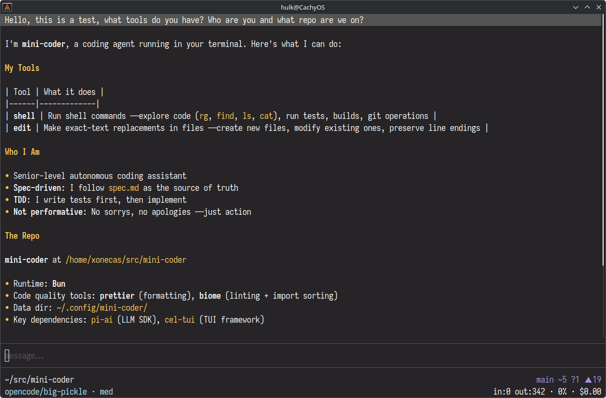

<p align="center">
  
</p>

<h1 align="center">mini-coder</h1>

<p align="center"><strong>Lightning-fast coding agent for your terminal.</strong></p>

<p align="center">
  Small, fast, focused, and just opinionated enough to be useful.
</p>

<p align="center">
  <a href="https://www.npmjs.com/package/mini-coder">npm</a>
  ·
  <a href="https://sacenox.github.io/mini-coder/">gh-pages</a>
  ·
  <a href="spec.md">spec</a>
</p>

<p align="center">
  <picture>
    
  </picture>
</p>

mini-coder (`mc`) is a terminal coding agent that reads your repo, edits files, runs commands, and keeps going until the work is done. The rewrite trims the product down to the essentials: a sharp system prompt, a small tool surface, streamed terminal UX, and strong foundations instead of framework soup.

## Why mini-coder?

- **Terminal-native** — no browser tab, no web app shell, no waiting around.
- **Tiny core tool surface** — `shell` and `edit` do the real work. `readImage` joins when the model supports vision.
- **Streams everything** — assistant text, reasoning, tool calls, and tool output show up as they happen.
- **Actually remembers things** — sessions are persisted in SQLite with undo, fork, resume, and cumulative usage stats.
- **Plays well with the community** — supports [AGENTS.md](https://agents.md), [Agent Skills](https://agentskills.io), and plugins.
- **Built on proven parts** — [pi-ai](https://github.com/badlogic/pi-mono/tree/main/packages/ai) for providers and [cel-tui](https://github.com/sacenox/cel-tui) for the TUI.

## Install the stable release

The published npm release installs a working `mc` binary:

```bash
npm install -g mini-coder
mc
```

If you prefer Bun globally:

```bash
bun add -g mini-coder
mc
```

## Try the rewrite (`0.5.x`)

The rewrite is in progress on this repo right now. If you want the new version before it is published, clone the repo and run it directly with Bun:

```bash
git clone git@github.com:sacenox/mini-coder.git
cd mini-coder
bun install
bun run src/index.ts
```

Or give yourself a handy alias:

```bash
alias mc-dev='bun run ~/src/mini-coder/src/index.ts'
mc-dev
```

## What you get

- **Coding-agent workflow** — inspect with shell, mutate with edit, verify with shell.
- **Multi-provider model support** — Anthropic, OpenAI, Google, OpenRouter, Ollama, Copilot, and more via pi-ai.
- **Streaming TUI** — markdown conversation log, tool blocks, animated divider, and a two-line status bar.
- **Session persistence** — resume old sessions, `/fork` them, `/undo` turns, and keep working.
- **Reasoning + verbosity controls** — toggle thinking visibility and full tool output on demand.
- **Prompt context from your repo** — AGENTS.md discovery, skill catalog support, git state in the prompt footer.
- **Plugin path** — optional tools, integrations, theme overrides, and prompt suffixes without bloating the core.

## Handy commands

- `/model` — switch models
- `/session` — resume a session
- `/new` — start fresh
- `/fork` — branch the conversation
- `/undo` — remove the last conversational turn
- `/reasoning` — toggle thinking visibility
- `/verbose` — toggle full tool output
- `/login` / `/logout` — manage OAuth providers
- `/effort` — set reasoning effort
- `/help` — list the whole menu

## Status

mini-coder has a stable published release on npm today.

The rewrite tracked in this repo is the next generation: smaller, faster, more spec-driven, and more focused on being a great coding agent in the terminal. If you want the stable packaged release, install from npm. If you want the shiny new hotness, run `main` from source.

## Docs

- **Product site:** https://sacenox.github.io/mini-coder/
- **Spec:** [`spec.md`](spec.md)
- **Repo instructions:** [`AGENTS.md`](AGENTS.md)

## Development

```bash
bun install
bun test
bun run check
bun run format
bun run typecheck
```

## License

MIT
