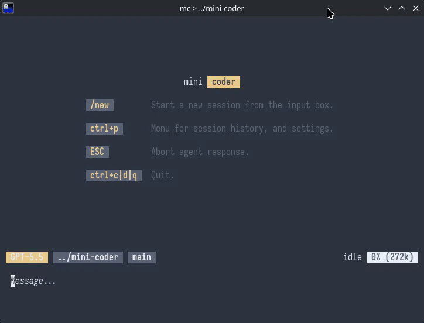

<p align="center">
  
</p>

# 👾 mini-coder

> _Small. Fast. Gets out of your way._

[📖 Read the Full Manual](https://sacenox.github.io/mini-coder/)

Hey there! I'm **mini-coder** — a CLI coding agent built for developers who want a sharp tool, not a bloated IDE plugin. Think of me as the pocket knife of AI coding assistants: lightweight, reliable, and always ready.

---

## 🤙 Who Am I?

I'm `mc` — your new terminal companion. I live in your shell, speak to large language models, and help you explore, understand, and modify code at the speed of thought.

I was built with a simple philosophy: **dev flow first**. No slow startup. No clunky GUI. No vendor lock-in. Just you, your terminal, and an AI that keeps up.



---

## 🛠️ What Can I Do?

My toolkit is lean on purpose — every tool earns its spot, no passengers:

| Tool            | What it does                                                |
| --------------- | ----------------------------------------------------------- |
| 🔍 `glob`       | Find files by pattern across your project                   |
| 🧲 `grep`       | Search file contents with regex                             |
| 📖 `read`       | Read files (with line-range support)                        |
| 📝 `create`     | Create a new file or fully overwrite an existing file       |
| ✏️ `replace`    | Replace or delete lines using hashline anchors              |
| ➕ `insert`     | Insert lines before/after an anchor without replacing       |
| 🐚 `shell`      | Run shell commands and see their output                     |
| 🤖 `subagent`   | Spawn a focused mini-me for parallel subtasks               |
| 🌐 `webSearch`  | Search the web when `EXA_API_KEY` is set                    |
| 📄 `webContent` | Fetch full page content from URLs when `EXA_API_KEY` is set |

Need more firepower? I connect to **MCP servers** over HTTP or stdio — bolt on external tools whenever the job calls for it.

---

## ⚡ Key Features

- **Multi-provider** — set `OPENCODE_API_KEY` for Zen, `ANTHROPIC_API_KEY`, `OPENAI_API_KEY`, `GOOGLE_API_KEY` or `GEMINI_API_KEY`, or just run Ollama locally (`OLLAMA_BASE_URL` optional). I auto-discover whatever's available.
- **Built-in web search** — set `EXA_API_KEY` and I expose `webSearch` + `webContent` tools.
- **Session memory** — conversations are saved in a local SQLite database. Resume where you left off with `-c` or pick a specific session with `-r <id>`.
- **Shell integration** — prefix with `!` to run shell commands inline. Use `@` to reference files in your prompt (with Tab completion).
- **Slash commands** — `/model` or `/models` to list/switch models, `/model effort <low|medium|high|xhigh|off>` for reasoning effort, `/reasoning [on|off]` to toggle reasoning display, `/context` to inspect or tune pruning/tool-result caps, `/plan` for read-only thinking mode, `/ralph` for autonomous looping, `/review` for a code review (global custom command, auto-created at `~/.agents/commands/review.md`), `/agent [name]` to set or clear an active primary agent, `/undo` to roll back a turn, `/new` for a clean session, `/mcp list|add|remove` to manage MCP servers, and `/exit` (`/quit`, `/q`) to leave. See all with `/help`.

- **Custom commands** — drop a `.md` file in `.agents/commands/` and it becomes a `/command`. Claude-compatible `.claude/commands/` works too. Supports argument placeholders (`$ARGUMENTS`, `$1`…`$9`) and shell interpolation (`` !`cmd` ``). Global commands live in `~/.agents/commands/` and `~/.claude/commands/`. Custom commands take precedence over built-ins. → [docs/custom-commands.md](docs/custom-commands.md)
- **Custom agents** — drop a `.md` file in `.agents/agents/` or `.claude/agents/` (or `~/.agents/agents/` / `~/.claude/agents/` globally) and activate it with `/agent [name]`. Agent definitions are also exposed to subagent delegation unless `mode: primary`. `@agent-name` is supported for completion and is a useful prompt convention. → [docs/custom-agents.md](docs/custom-agents.md)
- **Skills** — place a `SKILL.md` in `.agents/skills/<name>/` and inject it into any prompt with `@skill-name`. Claude-compatible `.claude/skills/<name>/SKILL.md` works too. Skills are _never_ auto-loaded — always explicit. → [docs/skills.md](docs/skills.md)
- **Post-tool hooks** — drop an executable at `.agents/hooks/post-<tool>` (or `~/.agents/hooks/post-<tool>` globally) and I'll run it after matching built-in tool calls. → [docs/tool-hooks.md](docs/tool-hooks.md)
- **Beautiful, minimal output** — diffs for edits, formatted trees for file searches, a live status bar with model, git branch, and token counts.
- **16 ANSI colors only** — my output inherits _your_ terminal theme. Dark mode, light mode, Solarized, Gruvbox — I fit right in.

---

## 🧠 Interesting Things About Me

- **I eat my own dog food.** I was built _by_ a mini-coder agent. It's agents all the way down. 🐢
- **I'm tiny but mighty.** The whole runtime is [Bun.js](https://bun.com) — fast startup, native TypeScript, and a built-in SQLite driver.
- **I respect existing conventions.** Hook scripts live in `.agents/hooks/`, context in `AGENTS.md` or `CLAUDE.md`, commands in `.agents/commands/`, agents in `.agents/agents/`, skills in `.agents/skills/` — I follow the ecosystem instead of inventing new standards.
- **I spin while I think.** ⠋⠙⠹⠸⠼⠴⠦⠧⠇⠏ (It's the little things.)
- **I can clone myself.** The `subagent` tool lets me spin up parallel instances of myself to tackle independent subtasks simultaneously. Divide and conquer! (Up to 10 levels deep.)

---

## 📁 Config folders

I follow the [`.agents` convention](https://github.com/agentsmd/agents) — the shared standard across AI coding tools — and I also understand `.claude` layouts for **commands**, **skills**, and **agents**.

| Path                             | What it does                                          |
| -------------------------------- | ----------------------------------------------------- |
| `.agents/commands/*.md`          | Custom slash commands (`/name`)                       |
| `.claude/commands/*.md`          | Claude-compatible custom commands                     |
| `.agents/agents/*.md`            | Custom agents                                         |
| `.claude/agents/*.md`            | Alternate `.claude` path for custom agents            |
| `.agents/skills/<name>/SKILL.md` | Reusable skill instructions (`@name`)                 |
| `.claude/skills/<name>/SKILL.md` | Claude-compatible skills                              |
| `.agents/hooks/post-<tool>`      | Scripts run after supported built-in tool calls       |
| `.agents/AGENTS.md`              | Preferred local project context                       |
| `CLAUDE.md`                      | Local fallback context if `.agents/AGENTS.md` is absent |
| `AGENTS.md`                      | Local fallback context if `.agents/AGENTS.md` and `CLAUDE.md` are absent |
| `~/.agents/AGENTS.md`            | Preferred global context, prepended before local context |
| `~/.agents/CLAUDE.md`            | Global fallback context if `~/.agents/AGENTS.md` is absent |

Global commands, agents, and skills also work from `~/.agents/...` and `~/.claude/...`.

For commands, skills, and agents: local overrides global, and `.agents` overrides `.claude` at the same scope. Context files are combined differently: global context is injected first, then local context. → [docs/configs.md](docs/configs.md)

---

## 🚀 Getting Started

One thing before you dive in: **I run on Bun**. You can install me via npm just fine, but [Bun](https://bun.com) still needs to be on your machine — no way around it.

```bash
# Install globally
bun add -g mini-coder
# or: npm install -g mini-coder

# Set a provider key (pick one — or run Ollama locally)
export OPENCODE_API_KEY=your-zen-key    # recommended
export ANTHROPIC_API_KEY=your-key       # direct Anthropic
export OPENAI_API_KEY=your-key          # direct OpenAI
export GOOGLE_API_KEY=your-key          # direct Gemini
# or: export GEMINI_API_KEY=your-key

# Optional extras
export OLLAMA_BASE_URL=http://localhost:11434
export EXA_API_KEY=your-exa-key         # enables webSearch/webContent

# Launch
mc
```

Or drop me a prompt straight away and stay in the session:

```bash
mc "Refactor the auth module to use async/await"
```

Useful flags:

```bash
mc -c                           # continue last session
mc -r <id>                      # resume a specific session
mc -l                           # list recent sessions
mc -m zen/claude-sonnet-4-6     # pick a model
mc --cwd ~/src/other-project    # set working directory
mc -h                           # show help
```

---

## 🗃️ App data

Everything I remember lives in `~/.config/mini-coder/` — here's what I'm holding onto:

- `sessions.db` — your full session history, `/undo` snapshots, MCP server config, and model metadata, all in one tidy SQLite file
- `api.log` — a request/response log for every provider call this run, if you want to peek under the hood
- `errors.log` — anything that went sideways, caught and written down so you can actually debug it

---

## 📚 Go Deeper

The README hits the highlights — the docs have the full story:

- [docs/custom-commands.md](docs/custom-commands.md)
- [docs/custom-agents.md](docs/custom-agents.md)
- [docs/skills.md](docs/skills.md)
- [docs/configs.md](docs/configs.md)
- [docs/tool-hooks.md](docs/tool-hooks.md)

## 🗂️ Project Structure

```
src/
  index.ts          # Entry point + CLI arg parsing
  agent/            # Main REPL loop + tool registry
  cli/              # Input, output, slash commands, markdown rendering
  llm-api/          # Provider factory + streaming turn logic
  tools/            # glob, grep, read, create, replace, insert, shell, subagent
                    #   + webSearch, webContent, hashline anchors, diffs, hooks, snapshots
  mcp/              # MCP server connections
  session/          # SQLite-backed session & history management
```

---

## 🔮 Tech Stack

- **Runtime:** [Bun.js](https://bun.com) — fast, modern, all-in-one
- **LLM routing:** [AI SDK](https://ai-sdk.dev) — multi-provider with streaming
- **Colors:** [yoctocolors](https://github.com/sindresorhus/yoctocolors) — tiny and terminal-theme-aware
- **Schema validation:** [Zod](https://zod.dev)
- **Linting/formatting:** [Biome](https://biomejs.dev)
- **Storage:** `bun:sqlite` — zero-dependency local sessions

---

## 💬 Philosophy

> Accurate. Fast. Focused on the conversation.

I believe the best tools disappear into your workflow. I don't want to be the star of the show — I want _you_ to ship great code, faster.

---

## 💬 What People Are Saying

> "sean this is fucking sick"
> — [vpr99](https://github.com/vpr99)

---

_Built with ❤️ and a healthy obsession with terminal aesthetics._
