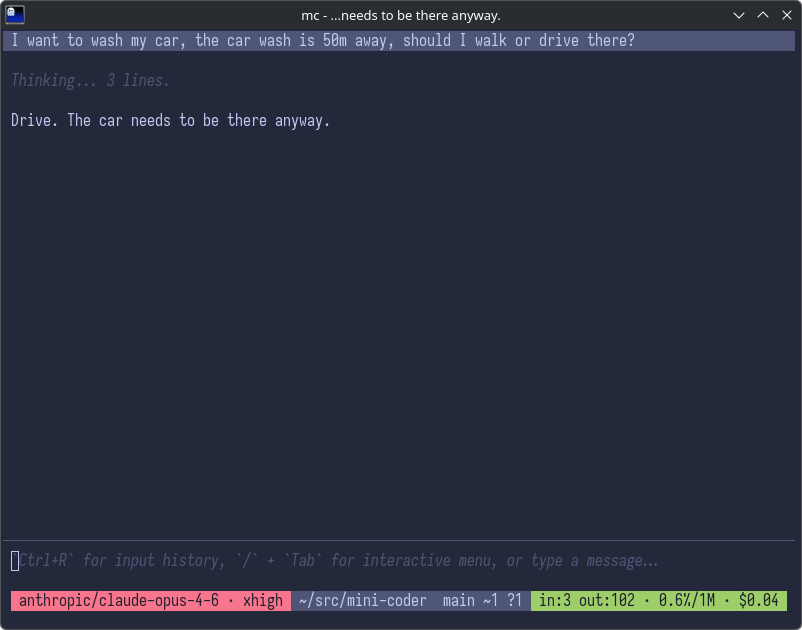
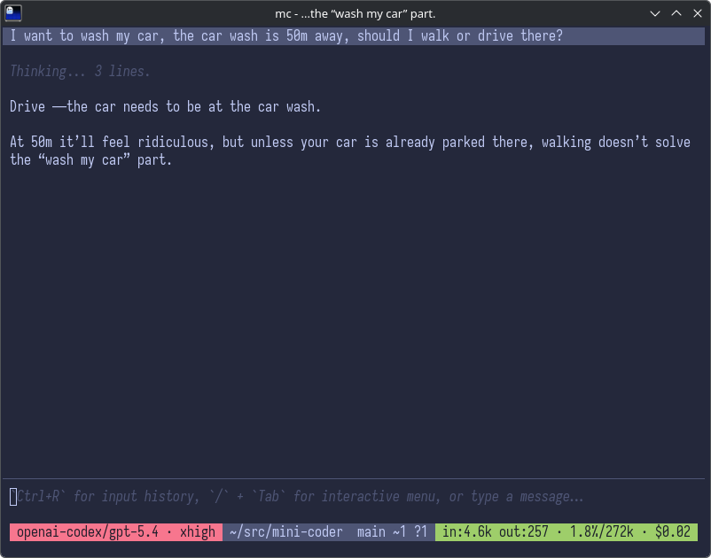

<p align="center">
  
</p>

<h1 align="center">mini-coder</h1>

<p align="center"><strong>Lightning-fast coding agent for your terminal.</strong></p>

<p align="center">
  <a href="https://www.npmjs.com/package/mini-coder">npm</a>
  ·
  <a href="https://sacenox.github.io/mini-coder/">docs</a>
  ·
  <a href="spec.md">spec</a>
</p>

<p align="center">
  <picture>
    
  </picture>
</p>

mini-coder (`mc`) is a terminal coding agent that reads your repo, edits files, runs commands, and keeps going until the work is done. Small core tool surface, flat architecture, fast turns, and streaming everywhere it matters.

## Install

```bash
$ bun add -g mini-coder
$ mc
```

## Why mini-coder?

- **Lean on proven dependencies** — [pi-ai](https://github.com/badlogic/pi-mono/tree/main/packages/ai) for providers, streaming, tool calling, usage tracking, and OAuth. [cel-tui](https://github.com/sacenox/cel-tui) for the terminal UI. The core stays focused on agent work.
- **Flat, simple codebase** — no workspaces, no internal abstraction layers. Files grouped by concern in a single `src/` directory.
- **Agent-first** — every decision serves the goal of reading code, making changes, and verifying them via the shell.
- **Performance** — startup and turn latency matter more than features.
- **Streaming end-to-end** — assistant text, reasoning, tool calls, and tool output show up as they happen.

## Tools

Six built-in tools, plus a conditional read-only image tool and any configured MCP tools:

- **`shell`** — runs commands in the user's shell. Returns stdout, stderr, and exit code. Large output is truncated to protect model context.
- **`read`** — reads UTF-8 text files from disk, optionally by line window.
- **`grep`** — searches file contents with ripgrep-style options and returns structured matches.
- **`edit`** — exact-text replacement in a single file. Fails deterministically if the target is missing or ambiguous. Creates new files when old text is empty.
- **`todoWrite`** — creates or updates the session todo list incrementally and returns the full current snapshot.
- **`todoRead`** — returns the full current session todo list snapshot.
- **`readImage`** — reads PNG, JPEG, GIF, and WebP files as model input. Only registered when the active model supports images.
- **Configured MCP tools** — tools discovered from `settings.json` Streamable HTTP MCP servers. Imported tool names are prefixed with the server name, for example `docs__search`.

## Features

- **Multi-provider model support** — Anthropic, OpenAI, Google, Bedrock, Mistral, Groq, xAI, OpenRouter, Ollama, Copilot, and more via pi-ai.
- **Streaming TUI** — markdown conversation log, tool blocks with diffs, animated divider, multi-line input, and a one-line pill status bar with independent ANSI16 effort/context tones.
- **Session persistence** — SQLite-backed sessions with undo, fork, resume, and cumulative usage stats. Sessions are scoped to the working directory.
- **Reasoning and verbosity controls** — toggle thinking visibility and verbose tool rendering on demand. Preferences persist across launches.
- **[AGENTS.md](https://agents.md) support** — project-specific instructions discovered root-to-leaf, with `~/.agents/` for global instructions.
- **[Agent Skills](https://agentskills.io)** — skill catalogs exposed in the prompt. `/skill:name` injects a skill body into the next user message.
- **Settings-driven MCP tools** — connect Streamable HTTP MCP servers from `~/.config/mini-coder/settings.json` and expose their tools directly in the core runtime.

## Commands

| Command      | Description                                                                                            |
| ------------ | ------------------------------------------------------------------------------------------------------ |
| `/model`     | Switch models and save the choice as the global default.                                               |
| `/session`   | Open the session picker for the current working directory.                                             |
| `/new`       | Start a fresh session and reset the running token and cost totals.                                     |
| `/fork`      | Fork the current chat into a new session, keep the original, and add a UI-only `Forked session.` note. |
| `/undo`      | Remove the last conversational turn without touching filesystem changes.                               |
| `/reasoning` | Show or hide model thinking. The setting is saved and restored on launch.                              |
| `/verbose`   | Expand shell output plus edit previews and edit errors in the conversation log.                        |
| `/mcp`       | Open the MCP server picker and toggle discovered servers on or off for future turns.                   |
| `/todo`      | Show the current session todo list in the conversation log as a UI-only checklist block.               |
| `/login`     | Sign in with a supported OAuth provider.                                                               |
| `/logout`    | Remove saved OAuth credentials for a logged-in provider.                                               |
| `/effort`    | Choose low, medium, high, or xhigh reasoning effort.                                                   |
| `/help`      | Show commands, current toggles, loaded AGENTS.md files, skills, and MCP servers with on/off state.     |

## Key bindings

| Key           | Action                                                                                                     |
| ------------- | ---------------------------------------------------------------------------------------------------------- |
| `Enter`       | Submit message                                                                                             |
| `Shift+Enter` | Insert newline                                                                                             |
| `Escape`      | Dismiss the overlay without changing the draft; otherwise interrupt the running turn; otherwise do nothing |
| `Tab`         | Autocomplete a path, or open the command picker when the draft starts with `/`                             |
| `Ctrl+R`      | Search global raw input history                                                                            |
| `Ctrl+C`      | Graceful exit                                                                                              |
| `Ctrl+D`      | Graceful exit when the input is empty                                                                      |
| `:q`          | Graceful exit                                                                                              |
| `Ctrl+Z`      | Suspend the process                                                                                        |
| Mouse wheel   | Scroll conversation history                                                                                |

## Headless one-shot mode

mini-coder also supports a non-interactive one-shot mode for scripts and benchmark harnesses.

```bash
$ mc -p "summarize this repo"
$ printf '%s\n' 'fix the failing tests' | mc
```

- Starts when `-p/--prompt` is provided or when stdin or stdout is not a TTY.
- If stdout is redirected but stdin is still interactive, pass `-p`; headless mode will not fall back to an interactive prompt.
- Uses the same parser as the TUI for plain text, `/skill:name`, and standalone image paths.
- Without `--json`, keeps stdout script-friendly by writing only the final assistant text there, while lightweight assistant commentary snippets from tool-use turns go to stderr.
- With `--json`, writes NDJSON events for completed assistant/tool-result messages plus `done` / `error` / `aborted` outcomes; queued `user_message` events may also appear. Streaming deltas are omitted.
- Headless runs still persist like normal sessions and show up in `/session` history for that working directory.
- Interactive slash commands such as `/model`, `/session`, `/mcp`, and `/help` are not available in headless mode.

## Settings

Global defaults live in `~/.config/mini-coder/settings.json`.

```json
{
  "customProviders": [
    {
      "name": "lm-studio",
      "baseUrl": "http://127.0.0.1:1234/v1"
    }
  ],
  "mcp": {
    "servers": [
      {
        "name": "docs",
        "url": "http://127.0.0.1:8787/mcp"
      }
    ]
  }
}
```

- `mcp.servers` currently supports Streamable HTTP MCP endpoints.
- Each server `name` becomes the imported tool prefix, so a remote `search` tool appears as `docs__search`.
- MCP servers are connected at startup; invalid or unreachable ones are skipped with a warning.
- `/mcp` can temporarily enable or disable discovered MCP servers for future turns during the current app run.

## Docs

- **Docs site:** https://sacenox.github.io/mini-coder/
- **Spec:** [`spec.md`](spec.md)
- **Repo instructions:** [`AGENTS.md`](AGENTS.md)

## Development

```bash
bun install
bun test
bun run check
bun run format
bun run typecheck
```

## Also makes LLMs smarter

LLMs famously tell you to walk 50 meters to the car wash — forgetting the car needs to be there too. Not on our watch.

<table align="center">
  <tr>
    <td></td>
    <td></td>
  </tr>
</table>

## License

MIT
