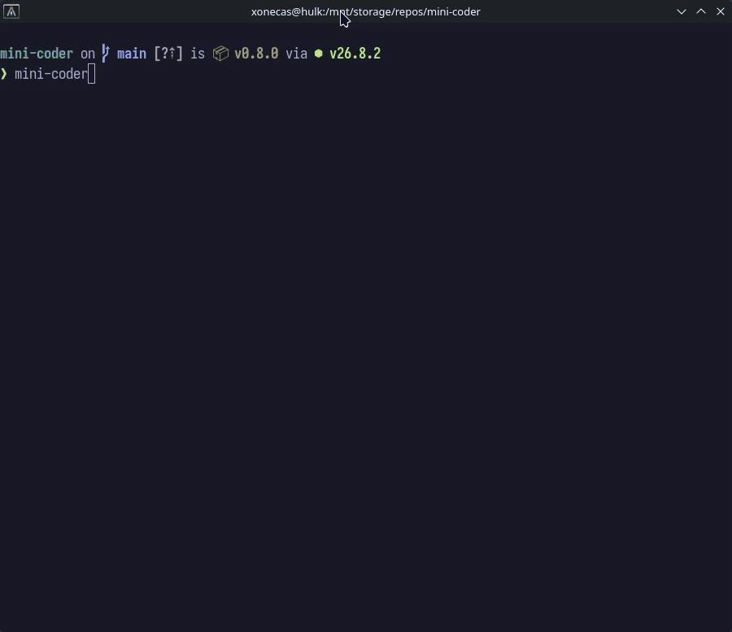

<p align="center">
  
</p>

# mini-coder

A fast, transparent, config-first terminal coding agent. One provider request at a time, no
hidden machinery: `edit`, `read`, and `bash`, an append-only JSONL session log, and a config
file that decides everything.

## Install

```sh
npm i -g mini-coder
```

## Configuration

Global config lives at `~/.config/mini-coder/config.json` (`$XDG_CONFIG_HOME/mini-coder/config.json`
if set). There is no project-local config and no override flags.

```json
{
  "provider": "anthropic",
  "model": "claude-sonnet-4-5"
}
```

Only `provider` and `model` are required. Defaults for the rest:

```json
{
  "sessionsDir": "./sessions",
  "systemPrompt": "",
  "discoverAgentFiles": true,
  "skillsDirs": [],
  "tools": ["edit", "read", "bash"],
  "thinkingEffort": "medium",
  "customProviders": []
}
```

- `provider` / `model` — any model from the `pi-ai` catalog. Invalid pairs fail with a
  list of available models for that provider.
- `sessionsDir` — where append-only session JSONL files are written. (no relative paths for now, absolute paths only).
- `systemPrompt` — the base of the system prompt. Skills and agent files, if
  enabled, are appended after it.
- `discoverAgentFiles` — when true, appends `AGENTS.md` / `CLAUDE.md` found in `~/.agents`
  and the working directory to the system prompt.
- `skillsDirs` — directories of skills to advertise (`<dir>/<skill>/SKILL.md` with
  `name:` and `description:` frontmatter). Paths, not contents, go to the model.
- `tools` — which of `edit`, `read`, `bash` the agent gets. Tool arguments are untrusted
  and validated at this boundary regardless.
- `thinkingEffort` — `minimal`, `low`, `medium`, `high`, `xhigh`, or `max` for models
  that support reasoning.

### Local and custom models

Hosted and local models are equals. Add unlisted or self-hosted models through
`customProviders` — the four wire APIs come from `pi-ai`, and auth resolves from your
environment via `envKeys` (no local model needs it):

```json
{
  "customProviders": [
    {
      "id": "ollama",
      "name": "Ollama",
      "baseUrl": "http://localhost:11434/v1",
      "api": "openai-completions",
      "models": ["qwen3-coder:30b", "gpt-oss:20b"]
    }
  ]
}
```

`api` is `openai-completions`, `openai-responses`, `anthropic-messages`, or
`google-generative-ai`. Then point `provider` and `model` at it.
