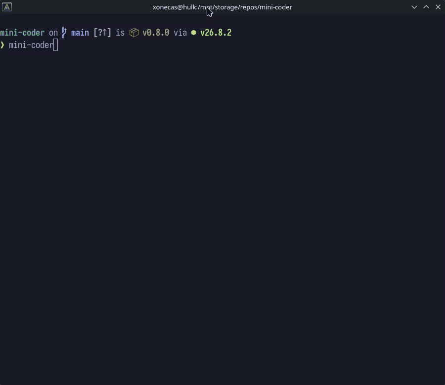

<p align="center">
  
</p>

# mini-coder

Minimalistic terminal coding agent, with an emphasis on giving you control of what is sent to
the model, and visibility into the model's actions.

Beautiful TUI with Tokyo Night colors, more to come soon.

We try to render diffs when the agent uses bash to edit, only for the current working directory; changes outside it aren't tracked.

## Install

```sh
npm i -g mini-coder
```

## Configuration

You can use `/login` and `/provider` to configure in the TUI. Changes are saved to your config.

Global config lives at `~/.config/mini-coder/config.json` (`$XDG_CONFIG_HOME/mini-coder/config.json`
if set). You can also configure your provider and model there:

```json
{
  "provider": "opencode-go",
  "model": "deepseek-v4.1-flash"
}
```

Defaults for the rest:

```json
{
  "sessionsDir": "./sessions",
  "systemPrompt": "",
  "discoverAgentFiles": true,
  "skillsDirs": [],
  "tools": ["edit", "read", "bash"],
  "thinkingEffort": "medium",
  "customProviders": []
}
```

- `provider` / `model` — any model from the `pi-ai` catalog. Requires a discoverable api key
  from the environment (like `OPENCODE_API_KEY`). When neither is set, the agent launches;
  sending a message reports that no model is configured.
- `sessionsDir` — where append-only session JSONL files are written. (no relative paths for now, absolute paths only).
- `systemPrompt` — the base of the system prompt. Skills and agent files, if
  enabled, are appended after it.
- `discoverAgentFiles` — when true, appends `AGENTS.md` / `CLAUDE.md` found in `~/.agents`
  and the working directory to the system prompt.
- `skillsDirs` — directories of skills to advertise (`<dir>/<skill>/SKILL.md` with
  `name:` and `description:` frontmatter). Paths, not contents, go to the model.
- `tools` — which of `edit`, `read`, `bash` the agent gets. Tool arguments are untrusted
  and validated at this boundary regardless.
- `thinkingEffort` — `minimal`, `low`, `medium`, `high`, `xhigh`, or `max` for models
  that support reasoning.

### Local and custom models

Hosted and local models are equals. Add unlisted or self-hosted models through
`customProviders` — the four wire APIs come from `pi-ai`, and auth resolves from your
environment via `envKeys` (no local model needs it):

```json
{
  "customProviders": [
    {
      "id": "ollama",
      "name": "Ollama",
      "baseUrl": "http://localhost:11434/v1",
      "api": "openai-completions",
      "models": ["qwen3-coder:30b", "gpt-oss:20b"]
    }
  ]
}
```

`api` is `openai-completions`, `openai-responses`, `anthropic-messages`, or
`google-generative-ai`. Then point `provider` and `model` at it.
